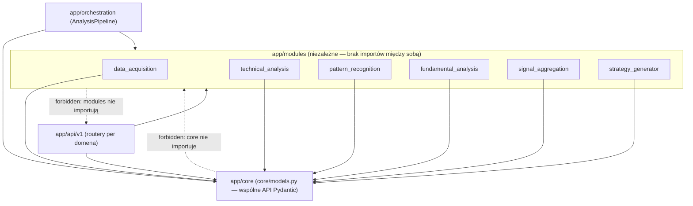
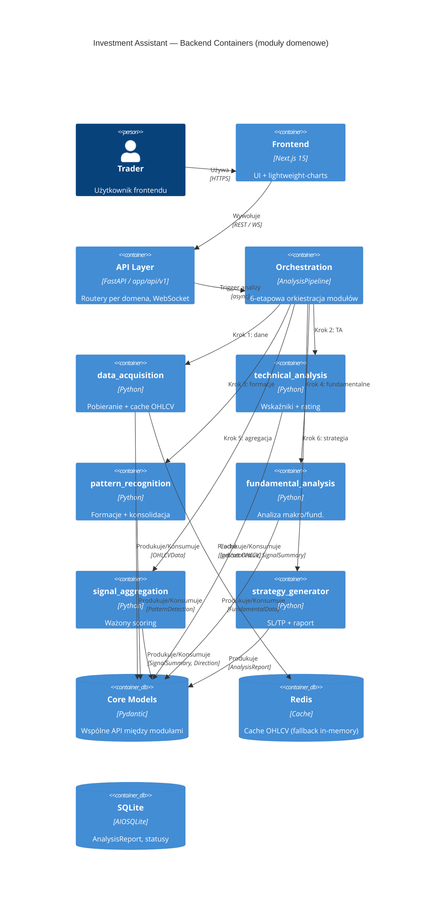

# Investment Assistant — Kontrakt Domenowy (Backend)

## Szczegóły Analizy

| Pole | Wartość |
|---|---|
| System | Investment Assistant (backend FastAPI) |
| Data analizy | 2026-07-18 |
| Cel modularyzacji | refinement (udokumentowanie istniejących granic modułów) |
| Powiązany Research | Brak — wymagania z Issue #209 (backlog IA-156) |
| Źródło prawdy o granicach | `backend/pyproject.toml` → `[tool.importlinter]` (kontrakty egzekwowane przez `import-linter`) |

## Mapa Subdomen

| Subdomena | Typ | Opis | Odpowiedzialność |
|---|---|---|---|
| data_acquisition | Core | Pozyskiwanie i cache'owanie danych rynkowych (OHLCV) z wielu providerów | Pobieranie świec OHLCV z fallback chain (YFinance → Twelve Data → FMP), cache Redis z fallbackiem in-memory, planowanie timeframe'ów |
| technical_analysis | Core | Obliczanie wskaźników technicznych i ocena sygnałów | 9 oscylatorów/momentum, 12 średnich kroczących, 5 typów pivot points, długoterminowy trend, rating sygnałów |
| pattern_recognition | Core | Wykrywanie formacji świecowych i geometrycznych | Formacje świecowe, wsparcie/opór, Fibonacci, detektor IKI, konsolidacja formacji wielotimeframe |
| fundamental_analysis | Supporting | Analiza makro/fundamentalna instrumentu | CPI (FRED, OECD SDMX, BLS, StatCan, BFS), dane FMP, analiza forex/commodities/indices |
| signal_aggregation | Core | Agregacja i ważenie sygnałów z TA, formacji i fundamentów | Normalizacja sygnałów do skali -1..+1, ważony scoring, określanie kierunku, kalibracja progów |
| strategy_generator | Core | Generowanie rekomendacji wejścia/wyjścia | Confidence scorer, kalkulator punktów wejścia, SL/TP, budowa raportu `AnalysisReport` |

## Bounded Contexts

### data_acquisition

| Pole | Wartość |
|---|---|
| Typ subdomeny | Core |
| Odpowiedzialność | Pozyskiwanie i cache'owanie danych rynkowych (OHLCV) z wielu providerów zewnętrznych |
| Zespół właściciel | TBD |
| Strategia integracji | OHS+PL (własne publiczne API: `RedisCache`, `create_redis_cache` w `__init__.py`) |

**Ubiquitous Language**:
| Termin | Definicja |
|---|---|
| DataProvider | Runtime-checkable Protocol kontraktu dostawcy danych (`interfaces.py`) |
| FallbackChain | Łańcuch providerów (YFinance → Twelve Data → FMP) z przełączaniem przy błędzie |
| MultiTimeframeFetcher | Pobieranie OHLCV dla wielu timeframe'ów jednocześnie |
| OHLCVCache | Warstwa cache (Redis z fallbackiem in-memory) dla świec |

### technical_analysis

| Pole | Wartość |
|---|---|
| Typ subdomeny | Core |
| Odpowiedzialność | Obliczanie wskaźników technicznych i ocena siły sygnałów |
| Zespół właściciel | TBD |
| Strategia integracji | OHS+PL (brak publicznego API w `__init__.py`; konsumuje/produkuje modele z `core/models.py`) |

**Ubiquitous Language**:
| Termin | Definicja |
|---|---|
| IndicatorValue | Wartość wskaźnika + przypisany sygnał (`SignalType`) |
| SignalRating | Ocena siły sygnału przez `rate_signal()` i `SIGNAL_RATING_CONFIG` |
| IndicatorPreset | Preset parametrów (INVESTING / TRADINGVIEW) |

### pattern_recognition

| Pole | Wartość |
|---|---|
| Typ subdomeny | Core |
| Odpowiedzialność | Wykrywanie formacji świecowych i geometrycznych oraz ich konsolidacja |
| Zespół właściciel | TBD |
| Strategia integracji | OHS+PL (brak publicznego API w `__init__.py`) |

**Ubiquitous Language**:
| Termin | Definicja |
|---|---|
| PatternDetection | Wykryta formacja (typ, kategoria, relevance_score, confidence) |
| PatternScannerResult | Skonsolidowana forma wielotimeframe (`consolidator.py`) |
| SupportResistance / Fibonacci / IKI | Konkretne detektory formacji |

### fundamental_analysis

| Pole | Wartość |
|---|---|
| Typ subdomeny | Supporting |
| Odpowiedzialność | Analiza makroekonomiczna i fundamentalna instrumentu (CPI, FRED, FMP) |
| Zespół właściciel | TBD |
| Strategia integracji | OHS+PL (brak publicznego API w `__init__.py`) |

**Ubiquitous Language**:
| Termin | Definicja |
|---|---|
| MacroDataSource | Źródło wskaźników makro (FRED, OECD SDMX, BLS, StatCan, BFS) |
| FundamentalData | Znormalizowany wynik analizy fundamentalnej (`core/models.py`) |
| COT | Commitments of Traders — pozycjonowanie spekulacyjne (dla commodities) |

### signal_aggregation

| Pole | Wartość |
|---|---|
| Typ subdomeny | Core |
| Odpowiedzialność | Normalizacja, ważenie i agregacja sygnałów z TA, formacji i fundamentów |
| Zespół właściciel | TBD |
| Strategia integracji | OHS+PL (brak publicznego API w `__init__.py`) |

**Ubiquitous Language**:
| Termin | Definicja |
|---|---|
| SignalAggregator | Agreguje `IndicatorValue`, `MovingAverage`, `SignalSummary`, `PatternDetection`, `FundamentalData` |
| SIGNAL_SCORE | Znormalizowana skala sygnału: -1.0 (strong sell) .. +1.0 (strong buy) |
| WeightedScore | Ważony wynik agregacji + określony kierunek (`Direction`) |

### strategy_generator

| Pole | Wartość |
|---|---|
| Typ subdomeny | Core |
| Odpowiedzialność | Generowanie rekomendacji wejścia/wyjścia (SL/TP, confidence, raport) |
| Zespół właściciel | TBD |
| Strategia integracji | OHS+PL (brak publicznego API w `__init__.py`) |

**Ubiquitous Language**:
| Termin | Definicja |
|---|---|
| StrategyEntry | Pojedynczy scenariusz wejścia/wyjścia |
| AnalysisReport | Końcowy raport analizy agregujący wyniki wszystkich modułów |
| ConfidenceScore | Ocena pewności rekomendacji |

## Diagram Modułów (UML Package)

## Diagram C4 Container

## Macierz Odpowiedzialności Modułów

| Moduł | Zdolności Biznesowe | Agregaty | Zdarzenia Publikowane | Zdarzenia Konsumowane |
|---|---|---|---|---|
| data_acquisition | Pobieranie OHLCV, cache, fallback chain, planowanie timeframe | OHLCVCache, FallbackChain, MultiTimeframeFetchBundle | (brak — synchroniczne API) | (brak) |
| technical_analysis | Obliczanie wskaźników, rating sygnałów, trend długoterminowy | IndicatorValue, MovingAverage, PivotPoints, LongTermTrend, SignalSummary | IndicatorValue, SignalSummary | OHLCVData |
| pattern_recognition | Detekcja formacji, konsolidacja wielotimeframe | PatternDetection, PatternScannerResult | PatternDetection, PatternScannerResult | OHLCVData |
| fundamental_analysis | Analiza CPI/makro, scoring COT | FundamentalData | FundamentalData | (symbol, instrument_type) |
| signal_aggregation | Ważony scoring, określanie kierunku | SignalAggregator, WeightedScore | SignalSummary (zaktualizowane), Direction | IndicatorValue, MovingAverage, SignalSummary, PatternDetection, FundamentalData |
| strategy_generator | Punkty wejścia, SL/TP, confidence, raport | StrategyEntry, AnalysisReport | AnalysisReport | wszystkie powyższe modele |

## Model Domenowy — Szczegóły Modułów

### Moduł: data_acquisition

**Agregaty**:
| Agregat (Root) | Encje | Value Objects | Invarianty |
|---|---|---|---|
| OHLCVCache | (brak osobnych encji) | OHLCVData, DataTimeframe | Cache traktuje OHLCV jako immutable; TTL i maxsize chronią przed wyciekiem pamięci |
| FallbackChain | YFinanceProvider, TwelveDataProvider, FMPProvider | DataProviderPriority | Kolejność providerów: PRIMARY → SECONDARY → TERTIARY → FALLBACK; błąd jednego nie przerywa łańcucha |

**Zdarzenia Domenowe**: brak (integracja synchroniczna przez modele).
**Polityki / Reguły Biznesowe**:
| Polityka | Wyzwalacz | Akcja | Opis |
|---|---|---|---|
| Cache-first | Żądanie OHLCV | Najpierw Redis, potem in-memory, na końcu provider | Redukcja obciążenia zewnętrznych API i quot |
**Usługi Domenowe**: `FallbackChainManager.build_fallback_chain()`, `MultiTimeframeFetcher`.
**Archetypy Biznesowe**: `OHLCVData` — Thing; `DataProvider` — Role (Protocol).

### Moduł: technical_analysis

**Agregaty**:
| Agregat (Root) | Encje | Value Objects | Invarianty |
|---|---|---|---|
| SignalSummary | IndicatorValue, MovingAverage, PivotPoints, LongTermTrend | IndicatorPreset | `rate_signal()` wiąże nazwę wskaźnika z kluczem `SIGNAL_RATING_CONFIG` (jedyna mapa) |

**Zdarzenia Domenowe**: brak.
**Polityki / Reguły Biznesowe**:
| Polityka | Wyzwalacz | Akcja | Opis |
|---|---|---|---|
| Preset selection | Wybór analizy | INVESTING lub TRADINGVIEW | Parametry wskaźników z presets |
**Usługi Domenowe**: `calculate_indicators()`, `calculate_moving_averages()`, `calculate_pivot_points()`, `build_long_term_trend()`, `rate_signal()`.
**Archetypy Biznesowe**: `IndicatorValue` — Description; `SignalSummary` — Moment-Interval (wynik analizy).

### Moduł: pattern_recognition

**Agregaty**:
| Agregat (Root) | Encje | Value Objects | Invarianty |
|---|---|---|---|
| PatternScannerResult | PatternDetection | PatternCategory, Timeframe | Konsolidacja grupuje po (pattern_type, category, bullish); reprezentant = max(relevance_score, confidence, reliability) |

**Zdarzenia Domenowe**: brak.
**Usługi Domenowe**: `consolidate_patterns()`, detektory (`candlestick`, `support_resistance`, `fibonacci`, `iki_detector`, `chart_patterns`).
**Archetypy Biznesowe**: `PatternDetection` — Moment-Interval.

### Moduł: fundamental_analysis

**Agregaty**:
| Agregat (Root) | Encje | Value Objects | Invarianty |
|---|---|---|---|
| FundamentalData | (agregowane z wielu źródeł) | InstrumentType | Wybór źródła zależy od typu instrumentu (forex/commodity/index) |

**Zdarzenia Domenowe**: brak.
**Usługi Domenowe**: `MacroDataSource`, `FmpEconomicSource`, `CpiFallbackSource`, analizatory (`commodities`, `forex`, `indices`).
**Archetypy Biznesowe**: `FundamentalData` — Description.

### Moduł: signal_aggregation

**Agregaty**:
| Agregat (Root) | Encje | Value Objects | Invarianty |
|---|---|---|---|
| SignalAggregator | (kompozycja sygnałów) | SignalType, Direction | Sygnał znormalizowany do SIGNAL_SCORE ∈ [-1.0, +1.0]; relevance_score > 0 nadpisuje confidence |

**Zdarzenia Domenowe**: brak.
**Usługi Domenowe**: `SignalAggregator`, `calculate_weighted_score()`, `determine_direction()`.
**Archetypy Biznesowe**: `SignalSummary` — Moment-Interval.

### Moduł: strategy_generator

**Agregaty**:
| Agregat (Root) | Encje | Value Objects | Invarianty |
|---|---|---|---|
| AnalysisReport | StrategyEntry | Direction, Timeframe | `build_report()` komponuje raport wyłącznie z modeli z `core/models.py` |

**Zdarzenia Domenowe**: brak.
**Usługi Domenowe**: `build_report()`, `calculate_confidence()`, `calculate_entry_points()`, `calculate_sl_tp()`.
**Archetypy Biznesowe**: `AnalysisReport` — Moment-Interval (końcowy wynik analizy).

## Analiza Autonomii

| Moduł | Autonomia Zmian | Autonomia Decyzji | Autonomia Deploymentu | Wynik |
|---|---|---|---|---|
| data_acquisition | ⬤⬤⬤⬤○ | ⬤⬤⬤⬤○ | ⬤⬤⬤⬤○ | Wysoka — własne publiczne API, brak zależności od innych modułów |
| technical_analysis | ⬤⬤⬤⬤○ | ⬤⬤⬤⬤○ | ⬤⬤⬤⬤○ | Wysoka — zależy tylko od `core/models.py` |
| pattern_recognition | ⬤⬤⬤⬤○ | ⬤⬤⬤⬤○ | ⬤⬤⬤⬤○ | Wysoka — zależy tylko od `core/models.py` |
| fundamental_analysis | ⬤⬤⬤⬤○ | ⬤⬤⬤⬤○ | ⬤⬤⬤⬤○ | Wysoka — zależy tylko od `core/models.py` |
| signal_aggregation | ⬤⬤⬤⬤○ | ⬤⬤⬤⬤○ | ⬤⬤⬤⬤○ | Wysoka — konsumuje modele, nie kod innych modułów |
| strategy_generator | ⬤⬤⬤⬤○ | ⬤⬤⬤⬤○ | ⬤⬤⬤⬤○ | Wysoka — komponuje raport z modeli |

> Wszystkie moduły są w pełni niezależne (brak shared kernel, brak importów między modułami). Autonomia deploymentu jest teoretyczna — system to modularny monolit (jeden proces FastAPI), ale granice pozwalają na przyszłą ekstrakcję.

## Ocena Granic Modułów

### Uzasadnienie Wag Kryteriów
System to modularny monolit analityczny. Najwyższa waga przypada **Dane** i **Zespół** (każdy moduł posiada własne dane wejściowe/wyjściowe przez `core/models.py`), średnia **Coupling/Cohesion** (wymuszane kontraktem `independence`), niska **Komunikacja** (synchroniczne wywołania przez orkiestrator, brak eventów).

### Macierz Ocen

| Granica (A↔B) | Coupling (w:X) | Cohesion (w:X) | Zmiana (w:X) | Zespół (w:X) | Deploy (w:X) | Dane (w:X) | Komunikacja (w:X) | Wynik Ważony |
|---|---|---|---|---|---|---|---|---|
| da ↔ ta | 0 | 0 | 0 | 0 | 0 | 0 | 0 | 0 (brak zależności) |
| ta ↔ pr | 0 | 0 | 0 | 0 | 0 | 0 | 0 | 0 |
| pr ↔ fa | 0 | 0 | 0 | 0 | 0 | 0 | 0 | 0 |
| fa ↔ sa | 0 | 0 | 0 | 0 | 0 | 0 | 0 | 0 |
| sa ↔ sg | 0 | 0 | 0 | 0 | 0 | 0 | 0 | 0 |

> Wszystkie pary modułów mają coupling = 0 (brak bezpośrednich importów). Komunikacja odbywa się wyłącznie przez `core/models.py` i orkiestrator `AnalysisPipeline`.

### Najsłabsze Granice
| Granica | Wynik | Problem | Rekomendacja |
|---|---|---|---|
| (brak) | — | Brak słabych granic — kontrakty import-linter egzekwowane w CI | Brak akcji (utrzymać kontrakt `independence`) |

## Testowanie Jakości Podziału

### Porównanie z Alternatywami

| Kryterium | Wybrany Podział (6 modułów + core) | Alternatywa: monolityczny pakiet `app/analysis` | Alternatywa: shared kernel (wspólne utilsy) |
|---|---|---|---|
| Opis | Niezależne moduły, wspólne API w `core/models.py` | Jeden pakiet, brak jawnych granic | Wspólne encje/serwisy dzielone bezpośrednio |
| Zalety | Jasne granice, łatwy onboarding, egzekwowane w CI | Prostsze na start | Mniej duplikacji kodu |
| Wady | Więcej plików, konieczność przekazywania modeli | Trudny refactor przy wzroście, ukryty coupling | Ukryty coupling, trudne zmiany niezależne |
| Ryzyko | Niskie (granice wymuszane) | Wysokie (spaghetti) | Średnie (shared kernel rot) |

**Uzasadnienie wyboru**: Podział na 6 niezależnych modułów z jedynym wspólnym punktem integracji w `core/models.py` minimalizuje coupling przy zachowaniu spójności domenowej. Granice są egzekwowane automatycznie przez `import-linter`, co eliminuje ryzyko regresji granic.

### Rejestr Ryzyk

| # | Ryzyko | Dotkliwość | Prawdopodobieństwo | Mitygacja | Status |
|---|---|---|---|---|---|
| 1 | Nowy moduł ominie kontrakt `independence` | Średnie | Niskie | Test architektoniczny `tests/architecture/test_import_boundaries.py` auto-odkrywa moduły i wymusza rejestrację | Zmitigowane |
| 2 | Bezpośredni import między modułami (obejście granicy) | Wysokie | Niskie | Kontrakt `independence` import-linter w CI (fails build) | Zmitigowane |

### Scenariusze Ewolucji

| Scenariusz | Wpływ na Moduły | Liczba Zmian | Ocena |
|---|---|---|---|
| Nowa zdolność biznesowa: dodanie modułu `risk_management` | Nowy moduł + rejestracja w `independence` + orkiestracja | 2 (moduł + pipeline) | ✅ OK |
| Restrukturyzacja zespołu: podział TA na `indicators` i `signals` | Rozbicie modułu, aktualizacja kontraktu | 2 | ✅ OK |
| Spike ruchu: cache'owanie tylko w `data_acquisition` | Izolowane w 1 module | 1 | ✅ OK |
| Nowa integracja: dodanie providera danych (np. Alpha Vantage) | Tylko `data_acquisition/providers` | 1 | ✅ OK |

### Metryki Coupling/Cohesion

| Moduł | Ca (afferent) | Ce (efferent) | I (instability) | A (abstractness) | D (distance) |
|---|---|---|---|---|---|
| data_acquisition | 1 (orch) | 1 (core) | 0.5 | niska | ~średnia |
| technical_analysis | 1 (orch) | 1 (core) | 0.5 | niska | ~średnia |
| pattern_recognition | 1 (orch) | 1 (core) | 0.5 | niska | ~średnia |
| fundamental_analysis | 1 (orch) | 1 (core) | 0.5 | niska | ~średnia |
| signal_aggregation | 1 (orch) | 1 (core) | 0.5 | niska | ~średnia |
| strategy_generator | 1 (orch) | 1 (core) | 0.5 | niska | ~średnia |

**Walidacja zależności**:
- [x] Brak zależności cyklicznych (moduły importują tylko `core`, nigdy siebie nawzajem)
- [x] Stable Abstractions Principle: moduły są konkretne (niskie A), ale stabilne (niskie I dzięki brakowi zależności wychodzących do innych modułów)
- [x] Kierunek zależności: `api`/`orchestration` → `modules` → `core`

## Kontrakty Między Modułami

### AnalysisPipeline → wszystkie moduły

| Pole | Wartość |
|---|---|
| Typ integracji | Synchroniczna |
| Protokół | Direct reference (wywołanie funkcji w orkiestratorze) |
| Kontrakt | Modele Pydantic z `core/models.py` przekazywane jako argumenty/wyniki |
| Strategia | OHS+PL (Open Host Service + Published Language = modele w `core/models.py`) |
| Właściciel kontraktu | `core/models.py` (współdzielony, read-only dla modułów) |

### Moduł A → Moduł B (bezpośrednio)

| Pole | Wartość |
|---|---|
| Typ integracji | Brak — zabronione przez kontrakt `independence` |
| Protokół | N/A |
| Kontrakt | N/A |
| Strategia | N/A |
| Właściciel kontraktu | N/A |

## Słownik Ubiquitous Language

| Termin | Bounded Context | Definicja |
|---|---|---|
| OHLCVData | data_acquisition | Świeca (open/high/low/close/volume) — podstawowa jednostka danych rynkowych |
| IndicatorValue | technical_analysis | Wartość wskaźnika z przypisanym sygnałem |
| SignalSummary | technical_analysis / signal_aggregation | Podsumowanie sygnałów technicznych |
| PatternDetection | pattern_recognition | Wykryta formacja świecowa/geometryczna |
| FundamentalData | fundamental_analysis | Znormalizowany wynik analizy fundamentalnej |
| SignalType | signal_aggregation | Typ sygnału (STRONG_SELL..STRONG_BUY) |
| Direction | signal_aggregation | Kierunek rekomendacji (BUY/SELL/NEUTRAL) |
| StrategyEntry | strategy_generator | Scenariusz wejścia/wyjścia z SL/TP |
| AnalysisReport | strategy_generator | Końcowy raport analizy |

## Otwarte Pytania

| # | Pytanie | Odpowiedź | Status |
|---|---|---|---|
| 1 | Czy `domain.md` powinien obejmować `api/` i `core/` jako konteksty? | Nie — Issue ogranicza zakres do `app/modules/`; `core`/`api` opisane jako ograniczenia zewnętrzne | ✅ Rozwiązane |
| 2 | Czy wymagana jest pełna macierz oceny z wagami? | Nie — to dokumentacja istniejących granic; granice egzekwowane przez import-linter | ✅ Rozwiązane |

## Usprawnienia (Poza Zakresem)

- Auto-weryfikacja `domain.md` vs import-linter (test porównujący listę modułów z dokumentu z kontraktem `independence`).
- Rozszerzenie `domain.md` o warstwy `api/` i `core/` jako pełne bounded contexts.
- Diagram przepływu danych przez `AnalysisPipeline` (sekwencyjny flowchart modeli Pydantic).

## Changelog

| Data | Opis Zmiany |
|------|-------------------|
| 2026-07-18 | Utworzono kontrakt domenowy dokumentujący granice 6 modułów w `app/modules/` (Issue #209 / IA-156) |
