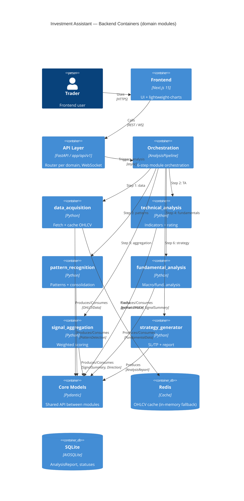

# Investment Assistant — Domain Contract (Backend)

## Analysis Details

| Field | Value |
|---|---|
| System | Investment Assistant (FastAPI backend) |
| Analysis date | 2026-07-18 |
| Modularization goal | refinement (documenting existing module boundaries) |
| Related Research | None — requirements from Issue #209 (backlog IA-156) |
| Boundary source of truth | `backend/pyproject.toml` → `[tool.importlinter]` (contracts enforced by `import-linter`) |

## Subdomain Map

| Subdomain | Type | Description | Responsibility |
|---|---|---|---|
| data_acquisition | Core | Acquisition and caching of market data (OHLCV) from multiple providers | Fetching OHLCV candles via fallback chain (YFinance → Twelve Data → FMP), Redis cache with in-memory fallback, timeframe scheduling |
| technical_analysis | Core | Computing technical indicators and assessing signal strength | 9 oscillators/momentum, 12 moving averages, 5 pivot point types, long-term trend, signal rating |
| pattern_recognition | Core | Detecting candlestick and geometric patterns | Candlestick patterns, support/resistance, Fibonacci, IKI detector, multi-timeframe pattern consolidation |
| fundamental_analysis | Supporting | Macro/fundamental analysis of the instrument | CPI (FRED, OECD SDMX, BLS, StatCan, BFS), FMP data, forex/commodities/indices analysis |
| signal_aggregation | Core | Aggregation and weighting of signals from TA, patterns and fundamentals | Normalizing signals to scale -1..+1, weighted scoring, direction determination, threshold calibration |
| strategy_generator | Core | Generating entry/exit recommendations | Confidence scorer, entry point calculator, SL/TP, building the `AnalysisReport` |

## Bounded Contexts

### data_acquisition

| Field | Value |
|---|---|
| Subdomain type | Core |
| Responsibility | Acquisition and caching of market data (OHLCV) from multiple external providers |
| Owner team | TBD |
| Integration strategy | OHS+PL (own public API: `RedisCache`, `create_redis_cache` in `__init__.py`) |

**Ubiquitous Language**:
| Term | Definition |
|---|---|
| DataProvider | Runtime-checkable Protocol of the data provider contract (`interfaces.py`) |
| FallbackChain | Chain of providers (YFinance → Twelve Data → FMP) with failover on error |
| MultiTimeframeFetcher | Fetching OHLCV for multiple timeframes simultaneously |
| OHLCVCache | Cache layer (Redis with in-memory fallback) for candles |

### technical_analysis

| Field | Value |
|---|---|
| Subdomain type | Core |
| Responsibility | Computing technical indicators and assessing signal strength |
| Owner team | TBD |
| Integration strategy | OHS+PL (no public API in `__init__.py`; consumes/produces models from `core/models.py`) |

**Ubiquitous Language**:
| Term | Definition |
|---|---|
| IndicatorValue | Indicator value + assigned signal (`SignalType`) |
| SignalRating | Signal strength assessment via `rate_signal()` and `SIGNAL_RATING_CONFIG` |
| IndicatorPreset | Parameter preset (INVESTING / TRADINGVIEW) |

### pattern_recognition

| Field | Value |
|---|---|
| Subdomain type | Core |
| Responsibility | Detecting candlestick and geometric patterns and consolidating them |
| Owner team | TBD |
| Integration strategy | OHS+PL (no public API in `__init__.py`) |

**Ubiquitous Language**:
| Term | Definition |
|---|---|
| PatternDetection | Detected pattern (type, category, relevance_score, confidence) |
| PatternScannerResult | Consolidated multi-timeframe pattern (`consolidator.py`) |
| SupportResistance / Fibonacci / IKI | Specific pattern detectors |

### fundamental_analysis

| Field | Value |
|---|---|
| Subdomain type | Supporting |
| Responsibility | Macroeconomic and fundamental analysis of the instrument (CPI, FRED, FMP) |
| Owner team | TBD |
| Integration strategy | OHS+PL (no public API in `__init__.py`) |

**Ubiquitous Language**:
| Term | Definition |
|---|---|
| MacroDataSource | Source of macro indicators (FRED, OECD SDMX, BLS, StatCan, BFS) |
| FundamentalData | Normalized result of fundamental analysis (`core/models.py`) |
| COT | Commitments of Traders — speculative positioning (for commodities) |

### signal_aggregation

| Field | Value |
|---|---|
| Subdomain type | Core |
| Responsibility | Normalization, weighting and aggregation of signals from TA, patterns and fundamentals |
| Owner team | TBD |
| Integration strategy | OHS+PL (no public API in `__init__.py`) |

**Ubiquitous Language**:
| Term | Definition |
|---|---|
| SignalAggregator | Aggregates `IndicatorValue`, `MovingAverage`, `SignalSummary`, `PatternDetection`, `FundamentalData` |
| SIGNAL_SCORE | Normalized signal scale: -1.0 (strong sell) .. +1.0 (strong buy) |
| WeightedScore | Weighted aggregation result + determined direction (`Direction`) |

### strategy_generator

| Field | Value |
|---|---|
| Subdomain type | Core |
| Responsibility | Generating entry/exit recommendations (SL/TP, confidence, report) |
| Owner team | TBD |
| Integration strategy | OHS+PL (no public API in `__init__.py`) |

**Ubiquitous Language**:
| Term | Definition |
|---|---|
| StrategyEntry | Single entry/exit scenario |
| AnalysisReport | Final analysis report aggregating results from all modules |
| ConfidenceScore | Confidence assessment of the recommendation |

## Module Diagram (UML Package)

## C4 Container Diagram

## Module Responsibility Matrix

| Module | Business Capabilities | Aggregates | Events Published | Events Consumed |
|---|---|---|---|---|
| data_acquisition | OHLCV fetch, cache, fallback chain, timeframe scheduling | OHLCVCache, FallbackChain, MultiTimeframeFetchBundle | (none — synchronous API) | (none) |
| technical_analysis | Indicator computation, signal rating, long-term trend | IndicatorValue, MovingAverage, PivotPoints, LongTermTrend, SignalSummary | IndicatorValue, SignalSummary | OHLCVData |
| pattern_recognition | Pattern detection, multi-timeframe consolidation | PatternDetection, PatternScannerResult | PatternDetection, PatternScannerResult | OHLCVData |
| fundamental_analysis | CPI/macro analysis, COT scoring | FundamentalData | FundamentalData | (symbol, instrument_type) |
| signal_aggregation | Weighted scoring, direction determination | SignalAggregator, WeightedScore | SignalSummary (updated), Direction | IndicatorValue, MovingAverage, SignalSummary, PatternDetection, FundamentalData |
| strategy_generator | Entry points, SL/TP, confidence, report | StrategyEntry, AnalysisReport | AnalysisReport | all of the above models |

## Domain Model — Module Details

### Module: data_acquisition

**Aggregates**:
| Aggregate (Root) | Entities | Value Objects | Invariants |
|---|---|---|---|
| OHLCVCache | (no separate entities) | OHLCVData, DataTimeframe | Cache treats OHLCV as immutable; TTL and maxsize protect against memory leaks |
| FallbackChain | YFinanceProvider, TwelveDataProvider, FMPProvider | DataProviderPriority | Provider order: PRIMARY → SECONDARY → TERTIARY → FALLBACK; one provider's error does not break the chain |

**Domain Events**: none (synchronous integration via models).
**Policies / Business Rules**:
| Policy | Trigger | Action | Description |
|---|---|---|---|
| Cache-first | OHLCV request | Redis first, then in-memory, provider last | Reduces load on external APIs and quota |
**Domain Services**: `FallbackChainManager.build_fallback_chain()`, `MultiTimeframeFetcher`.
**Business Archetypes**: `OHLCVData` — Thing; `DataProvider` — Role (Protocol).

### Module: technical_analysis

**Aggregates**:
| Aggregate (Root) | Entities | Value Objects | Invariants |
|---|---|---|---|
| SignalSummary | IndicatorValue, MovingAverage, PivotPoints, LongTermTrend | IndicatorPreset | `rate_signal()` binds indicator name to `SIGNAL_RATING_CONFIG` key (single map) |

**Domain Events**: none.
**Policies / Business Rules**:
| Policy | Trigger | Action | Description |
|---|---|---|---|
| Preset selection | Analysis choice | INVESTING or TRADINGVIEW | Indicator parameters from presets |
**Domain Services**: `calculate_indicators()`, `calculate_moving_averages()`, `calculate_pivot_points()`, `build_long_term_trend()`, `rate_signal()`.
**Business Archetypes**: `IndicatorValue` — Description; `SignalSummary` — Moment-Interval (analysis result).

### Module: pattern_recognition

**Aggregates**:
| Aggregate (Root) | Entities | Value Objects | Invariants |
|---|---|---|---|
| PatternScannerResult | PatternDetection | PatternCategory, Timeframe | Consolidation groups by (pattern_type, category, bullish); representative = max(relevance_score, confidence, reliability) |

**Domain Events**: none.
**Domain Services**: `consolidate_patterns()`, detectors (`candlestick`, `support_resistance`, `fibonacci`, `iki_detector`, `chart_patterns`).
**Business Archetypes**: `PatternDetection` — Moment-Interval.

### Module: fundamental_analysis

**Aggregates**:
| Aggregate (Root) | Entities | Value Objects | Invariants |
|---|---|---|---|
| FundamentalData | (aggregated from multiple sources) | InstrumentType | Source selection depends on instrument type (forex/commodity/index) |

**Domain Events**: none.
**Domain Services**: `MacroDataSource`, `FmpEconomicSource`, `CpiFallbackSource`, analyzers (`commodities`, `forex`, `indices`).
**Business Archetypes**: `FundamentalData` — Description.

### Module: signal_aggregation

**Aggregates**:
| Aggregate (Root) | Entities | Value Objects | Invariants |
|---|---|---|---|
| SignalAggregator | (signal composition) | SignalType, Direction | Signal normalized to SIGNAL_SCORE ∈ [-1.0, +1.0]; relevance_score > 0 overrides confidence |

**Domain Events**: none.
**Domain Services**: `SignalAggregator`, `calculate_weighted_score()`, `determine_direction()`.
**Business Archetypes**: `SignalSummary` — Moment-Interval.

### Module: strategy_generator

**Aggregates**:
| Aggregate (Root) | Entities | Value Objects | Invariants |
|---|---|---|---|
| AnalysisReport | StrategyEntry | Direction, Timeframe | `build_report()` composes the report solely from `core/models.py` models |

**Domain Events**: none.
**Domain Services**: `build_report()`, `calculate_confidence()`, `calculate_entry_points()`, `calculate_sl_tp()`.
**Business Archetypes**: `AnalysisReport` — Moment-Interval (final analysis result).

## Autonomy Analysis

| Module | Change Autonomy | Decision Autonomy | Deployment Autonomy | Result |
|---|---|---|---|---|
| data_acquisition | ⬤⬤⬤⬤○ | ⬤⬤⬤⬤○ | ⬤⬤⬤⬤○ | High — own public API, no dependency on other modules |
| technical_analysis | ⬤⬤⬤⬤○ | ⬤⬤⬤⬤○ | ⬤⬤⬤⬤○ | High — depends only on `core/models.py` |
| pattern_recognition | ⬤⬤⬤⬤○ | ⬤⬤⬤⬤○ | ⬤⬤⬤⬤○ | High — depends only on `core/models.py` |
| fundamental_analysis | ⬤⬤⬤⬤○ | ⬤⬤⬤⬤○ | ⬤⬤⬤⬤○ | High — depends only on `core/models.py` |
| signal_aggregation | ⬤⬤⬤⬤○ | ⬤⬤⬤⬤○ | ⬤⬤⬤⬤○ | High — consumes models, not other modules' code |
| strategy_generator | ⬤⬤⬤⬤○ | ⬤⬤⬤⬤○ | ⬤⬤⬤⬤○ | High — composes report from models |

> All modules are fully independent (no shared kernel, no imports between modules). Deployment autonomy is theoretical — the system is a modular monolith (single FastAPI process), but the boundaries allow future extraction.

## Module Boundary Assessment

### Criterion Weight Rationale
The system is an analytical modular monolith. The highest weight goes to **Data** and **Team** (each module has its own inputs/outputs via `core/models.py`), medium to **Coupling/Cohesion** (enforced by the `independence` contract), low to **Communication** (synchronous calls via orchestrator, no events).

### Assessment Matrix

| Boundary (A↔B) | Coupling (w:X) | Cohesion (w:X) | Change (w:X) | Team (w:X) | Deploy (w:X) | Data (w:X) | Communication (w:X) | Weighted Result |
|---|---|---|---|---|---|---|---|---|
| da ↔ ta | 0 | 0 | 0 | 0 | 0 | 0 | 0 | 0 (no dependency) |
| ta ↔ pr | 0 | 0 | 0 | 0 | 0 | 0 | 0 | 0 |
| pr ↔ fa | 0 | 0 | 0 | 0 | 0 | 0 | 0 | 0 |
| fa ↔ sa | 0 | 0 | 0 | 0 | 0 | 0 | 0 | 0 |
| sa ↔ sg | 0 | 0 | 0 | 0 | 0 | 0 | 0 | 0 |

> All module pairs have coupling = 0 (no direct imports). Communication happens exclusively via `core/models.py` and the `AnalysisPipeline` orchestrator.

### Weakest Boundaries
| Boundary | Result | Problem | Recommendation |
|---|---|---|---|
| (none) | — | No weak boundaries — import-linter contracts enforced in CI | No action (maintain the `independence` contract) |

## Division Quality Testing

### Comparison with Alternatives

| Criterion | Chosen Division (6 modules + core) | Alternative: monolithic `app/analysis` package | Alternative: shared kernel (shared utils) |
|---|---|---|---|
| Description | Independent modules, shared API in `core/models.py` | Single package, no explicit boundaries | Shared entities/services used directly |
| Pros | Clear boundaries, easy onboarding, enforced in CI | Simpler to start | Less code duplication |
| Cons | More files, need to pass models | Hard refactor on growth, hidden coupling | Hidden coupling, hard independent changes |
| Risk | Low (boundaries enforced) | High (spaghetti) | Medium (shared kernel rot) |

**Choice rationale**: Dividing into 6 independent modules with the only integration point in `core/models.py` minimizes coupling while preserving domain coherence. Boundaries are enforced automatically by `import-linter`, eliminating the risk of boundary regressions.

### Risk Register

| # | Risk | Severity | Probability | Mitigation | Status |
|---|---|---|---|---|---|
| 1 | New module bypasses the `independence` contract | Medium | Low | Architecture test `tests/architecture/test_import_boundaries.py` auto-discovers modules and enforces registration | Mitigated |
| 2 | Direct import between modules (boundary bypass) | High | Low | `independence` import-linter contract in CI (fails build) | Mitigated |

### Evolution Scenarios

| Scenario | Impact on Modules | Number of Changes | Assessment |
|---|---|---|---|
| New business capability: adding `risk_management` module | New module + registration in `independence` + orchestration | 2 (module + pipeline) | ✅ OK |
| Team restructure: splitting TA into `indicators` and `signals` | Module split, contract update | 2 | ✅ OK |
| Traffic spike: caching only in `data_acquisition` | Isolated in 1 module | 1 | ✅ OK |
| New integration: adding a data provider (e.g. Alpha Vantage) | Only `data_acquisition/providers` | 1 | ✅ OK |

### Coupling/Cohesion Metrics

| Module | Ca (afferent) | Ce (efferent) | I (instability) | A (abstractness) | D (distance) |
|---|---|---|---|---|---|
| data_acquisition | 1 (orch) | 1 (core) | 0.5 | low | ~medium |
| technical_analysis | 1 (orch) | 1 (core) | 0.5 | low | ~medium |
| pattern_recognition | 1 (orch) | 1 (core) | 0.5 | low | ~medium |
| fundamental_analysis | 1 (orch) | 1 (core) | 0.5 | low | ~medium |
| signal_aggregation | 1 (orch) | 1 (core) | 0.5 | low | ~medium |
| strategy_generator | 1 (orch) | 1 (core) | 0.5 | low | ~medium |

**Dependency validation**:
- [x] No cyclic dependencies (modules import only `core`, never each other)
- [x] Stable Abstractions Principle: modules are concrete (low A) but stable (low I thanks to no outgoing dependencies to other modules)
- [x] Dependency direction: `api`/`orchestration` → `modules` → `core`

## Inter-Module Contracts

### AnalysisPipeline → all modules

| Field | Value |
|---|---|
| Integration type | Synchronous |
| Protocol | Direct reference (function call in orchestrator) |
| Contract | Pydantic models from `core/models.py` passed as arguments/results |
| Strategy | OHS+PL (Open Host Service + Published Language = models in `core/models.py`) |
| Contract owner | `core/models.py` (shared, read-only for modules) |

### Module A → Module B (directly)

| Field | Value |
|---|---|
| Integration type | None — forbidden by the `independence` contract |
| Protocol | N/A |
| Contract | N/A |
| Strategy | N/A |
| Contract owner | N/A |

## Ubiquitous Language Dictionary

| Term | Bounded Context | Definition |
|---|---|---|
| OHLCVData | data_acquisition | Candle (open/high/low/close/volume) — basic unit of market data |
| IndicatorValue | technical_analysis | Indicator value with assigned signal |
| SignalSummary | technical_analysis / signal_aggregation | Summary of technical signals |
| PatternDetection | pattern_recognition | Detected candlestick/geometric pattern |
| FundamentalData | fundamental_analysis | Normalized result of fundamental analysis |
| SignalType | signal_aggregation | Signal type (STRONG_SELL..STRONG_BUY) |
| Direction | signal_aggregation | Recommendation direction (BUY/SELL/NEUTRAL) |
| StrategyEntry | strategy_generator | Entry/exit scenario with SL/TP |
| AnalysisReport | strategy_generator | Final analysis report |

## Open Questions

| # | Question | Answer | Status |
|---|---|---|---|
| 1 | Should `domain.md` cover `api/` and `core/` as contexts? | No — Issue scope is limited to `app/modules/`; `core`/`api` described as external constraints | ✅ Resolved |
| 2 | Is a full weighted assessment matrix required? | No — this documents existing boundaries; boundaries enforced by import-linter | ✅ Resolved |

## Improvements (Out of Scope)

- Auto-verification of `domain.md` vs import-linter (test comparing the module list in the document with the `independence` contract).
- Extending `domain.md` with `api/` and `core/` layers as full bounded contexts.
- Data flow diagram through `AnalysisPipeline` (sequential Pydantic model flowchart).

## Changelog

| Date | Change Description |
|------|-------------------|
| 2026-07-18 | Created domain contract documenting the boundaries of the 6 modules in `app/modules/` (Issue #209 / IA-156) |
